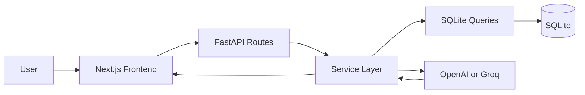

# AI Zoom Clone

A fullstack AI-powered collaboration platform inspired by Zoom Workplace.

The project demonstrates practical backend design, polished frontend engineering, and production-minded AI integration without overbuilding media infrastructure.

## What It Does

- Create instant meetings with generated meeting codes and invite links.
- Join meetings by code or invite link.
- Schedule future meetings.
- Track participants, mic state, camera state, join time, and leave time.
- Preview local camera and microphone in the meeting room.
- Submit transcripts and generate AI meeting intelligence.
- Persist AI summaries, transcripts, and action items.
- Display dashboard metrics, upcoming meetings, recent meetings, and participant counts.

## Architecture

```text
frontend/
  Next.js App Router
  TypeScript
  TailwindCSS
  Zustand
  centralized API services

backend/
  FastAPI
  SQLite
  direct SQL via sqlite3
  service-based business logic
  OpenAI/Groq-compatible AI layer
```

## System Flow



## Why These Decisions

- **Service-based backend:** routes stay thin and business logic stays testable.
- **Direct SQL:** the database design is visible, readable, and easy to explain in interviews.
- **Normalized schema:** meetings, participants, links, history, transcripts, summaries, and action items are separate because they change independently.
- **Separate AI tables:** AI outputs are durable artifacts that can be regenerated, audited, and compared by model.
- **Zustand:** state remains modular without the boilerplate of heavier state frameworks.
- **Centralized API layer:** frontend workflows use consistent loading and error behavior.
- **Transcript persistence:** summaries and action items are traceable back to source meeting content.

## AI Pipeline

```text
Transcript submitted
  -> normalized by backend
  -> stored in ai_transcripts
  -> summary generated
  -> summary stored in ai_meeting_summaries
  -> action items extracted
  -> tasks stored in ai_action_items
  -> frontend refreshes AI panels
```

The backend supports OpenAI and Groq through provider wrappers. If provider keys are unavailable, a local deterministic fallback keeps the workflow demoable.

## Lightweight Video Foundation

This project intentionally avoids complex conferencing infrastructure. Phase 4 adds:

- local webcam preview
- microphone permission handling
- camera permission handling
- mic and camera toggles
- participant placeholders
- backend participant state sync

Future production work could add WebRTC peer connections and WebSocket signaling.

## Setup

Backend:

```bash
pip install -r backend/requirements.txt
python -m backend.database.seed
uvicorn backend.main:app --host 127.0.0.1 --port 8000
```

Frontend:

```bash
cd frontend
npm install
npm run dev
```

Open:

- Frontend: `http://127.0.0.1:3000`
- Backend docs: `http://127.0.0.1:8000/docs`

## Environment

Backend `.env`:

```text
PUBLIC_BASE_URL=http://localhost:8000
OPENAI_API_KEY=
OPENAI_MODEL=gpt-4o-mini
GROQ_API_KEY=
GROQ_BASE_URL=https://api.groq.com/openai/v1
GROQ_MODEL=llama-3.1-8b-instant
```

Frontend `.env.local`:

```text
NEXT_PUBLIC_API_BASE_URL=http://127.0.0.1:8000/api/v1
```

## Deployment Notes

- Frontend is Vercel-ready from `frontend/`.
- Backend can run on Render or Railway with `uvicorn backend.main:app --host 0.0.0.0 --port $PORT`.
- SQLite is suitable for assignment deployment; for production, migrate the same schema concepts to PostgreSQL.

## Future Roadmap

- WebSocket signaling for two-user WebRTC.
- Recording upload and object storage.
- Transcript segment table with speaker diarization.
- Vector search over transcript chunks.
- Organization/workspace permissions.
- Calendar integrations.
- Production auth.


After phase-4, its ready for deployment