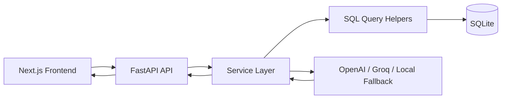

# AI Zoom Clone

A portfolio-quality AI-powered collaboration platform inspired by Zoom Workplace.

This project combines a clean FastAPI backend, normalized SQLite database, polished Next.js frontend, lightweight browser media, and AI meeting intelligence. It is intentionally designed to be interview-friendly: the architecture is modular, practical, and easy to explain without hiding core behavior behind excessive abstraction.

## Screenshots

Add final screenshots or GIFs here before publishing:

- `docs/screenshots/dashboard.png`
- `docs/screenshots/meeting-room.png`
- `docs/screenshots/ai-insights.png`
- `docs/demo/meeting-flow.gif`

## Features

- Instant meeting creation with generated meeting code and invite link.
- Join by meeting code or invite link.
- Scheduled meetings with duration and metadata.
- Dashboard metrics, recent meetings, upcoming meetings, and participant counts.
- Meeting room with participant grid, participant sidebar, local media preview, mic/camera toggles, and leave flow.
- Transcript submission and persisted transcript history.
- AI meeting summaries using OpenAI/Groq-compatible providers with local fallback.
- AI action item extraction with owner, priority, and status.
- Searchable transcript snippets.
- Toast notifications, loading states, empty states, retry behavior, and request timeouts.

## Architecture Overview



## Folder Structure

```text
backend/
  main.py
  schemas.py
  routes/          # Thin FastAPI route handlers
  services/        # Business logic and AI orchestration
  database/        # schema.sql, queries.py, connection helpers, seed data
  utils/           # prompts, IDs, transcript helpers, validation

frontend/
  app/             # Next.js App Router pages
  components/      # Reusable UI pieces
  features/        # Dashboard, meeting, scheduling, AI feature views
  services/        # Centralized API clients
  store/           # Zustand stores
  hooks/           # Local media and app hooks
  types/           # Shared TypeScript API types
```

## Database Design

The schema is normalized around product concepts:

- `users`
- `meetings`
- `participants`
- `meeting_links`
- `meeting_history`
- `ai_transcripts`
- `ai_meeting_summaries`
- `ai_action_items`

Why this matters:

- Meeting metadata is separate from participant attendance.
- Invite links can expire or rotate independently.
- Historical analytics do not bloat the core meeting row.
- AI outputs are durable artifacts and can be regenerated or compared by model.
- The schema stays easy to migrate to PostgreSQL later.

See:

- `backend/database/schema.sql`
- `backend/database/architecture.md`
- `backend/database/relationships.md`

## AI Feature Architecture

```text
Transcript submitted
  -> backend normalizes transcript
  -> transcript stored in ai_transcripts
  -> summary generated
  -> summary stored in ai_meeting_summaries
  -> action items extracted
  -> action items stored in ai_action_items
  -> frontend updates AI panels
```

Provider strategy:

- OpenAI wrapper for OpenAI models.
- Groq wrapper through OpenAI-compatible base URL.
- Local deterministic fallback for demos, tests, and missing API keys.
- Prompt templates live in `backend/utils/ai_utils.py`.

## API Structure

Meetings:

- `POST /api/v1/meetings`
- `GET /api/v1/meetings`
- `GET /api/v1/meetings/{meeting_id}`
- `PATCH /api/v1/meetings/{meeting_id}`
- `POST /api/v1/meetings/{meeting_id}/start`
- `POST /api/v1/meetings/{meeting_id}/end`
- `POST /api/v1/meetings/join`

Scheduling:

- `POST /api/v1/schedule`
- `GET /api/v1/schedule/upcoming`
- `POST /api/v1/schedule/{meeting_id}/cancel`

Participants:

- `GET /api/v1/participants/meeting/{meeting_id}`
- `PATCH /api/v1/participants/{participant_id}`
- `POST /api/v1/participants/{participant_id}/leave`

AI:

- `POST /api/v1/ai/transcripts`
- `POST /api/v1/ai/transcripts/process`
- `GET /api/v1/ai/meetings/{meeting_id}/transcripts`
- `GET /api/v1/ai/meetings/{meeting_id}/summaries`
- `POST /api/v1/ai/summaries/generate`
- `GET /api/v1/ai/meetings/{meeting_id}/action-items`
- `POST /api/v1/ai/action-items/generate`
- `POST /api/v1/ai/action-items`

## Setup

Backend:

```bash
pip install -r backend/requirements.txt
python -m backend.database.seed
uvicorn backend.main:app --host 127.0.0.1 --port 8000
```

Frontend:

```bash
cd frontend
npm install
npm run dev
```

Open:

- Frontend: `http://127.0.0.1:3000`
- Backend docs: `http://127.0.0.1:8000/docs`

## Environment Variables

Backend `.env`:

```text
PUBLIC_BASE_URL=http://localhost:3000
SQLITE_DB_PATH=backend/zoom_clone.db
OPENAI_API_KEY=
OPENAI_MODEL=gpt-4o-mini
GROQ_API_KEY=
GROQ_BASE_URL=https://api.groq.com/openai/v1
GROQ_MODEL=llama-3.1-8b-instant
```

Frontend `.env.local`:

```text
NEXT_PUBLIC_API_BASE_URL=http://127.0.0.1:8000/api/v1
```

## Deployment

Frontend:

- Deploy `frontend/` to Vercel.
- Set `NEXT_PUBLIC_API_BASE_URL` to the deployed backend URL plus `/api/v1`.

Backend:

- Deploy the repository to Render or Railway.
- Build: `pip install -r backend/requirements.txt`
- Start: `uvicorn backend.main:app --host 0.0.0.0 --port $PORT`
- `render.yaml` is included as a deployment starting point.

SQLite note:

- SQLite is appropriate for this assignment and simple deployment.
- For a production multi-user platform, migrate the same normalized schema to PostgreSQL.

## Technical Decisions

- **Direct SQL over ORM:** keeps schema and query behavior explicit and interview-friendly.
- **Service layer:** keeps route handlers thin and business rules centralized.
- **Zustand:** gives predictable state with minimal boilerplate.
- **Central API layer:** adds timeout/retry behavior in one place.
- **Separate AI tables:** keeps generated knowledge traceable and auditable.
- **Lightweight media:** demonstrates browser media capability without pretending to be production conferencing infrastructure.

## Tradeoffs and Assumptions

- This is not a production SFU-based conferencing system.
- Local camera preview is implemented; multi-user video would require WebRTC signaling.
- AI provider calls gracefully fall back when keys are unavailable.
- Auth is represented by a demo host ID to keep assignment scope focused.
- SQLite is used with production-style relational design for portability.

## Future Scalability Ideas

- PostgreSQL migration.
- Auth and workspace membership.
- WebSocket signaling for WebRTC peer setup.
- Recording upload and object storage.
- Transcript segments with speaker diarization.
- Vector search over transcript chunks.
- AI prompt run audit table.
- Calendar integrations.
- Background jobs for long-running AI processing.
