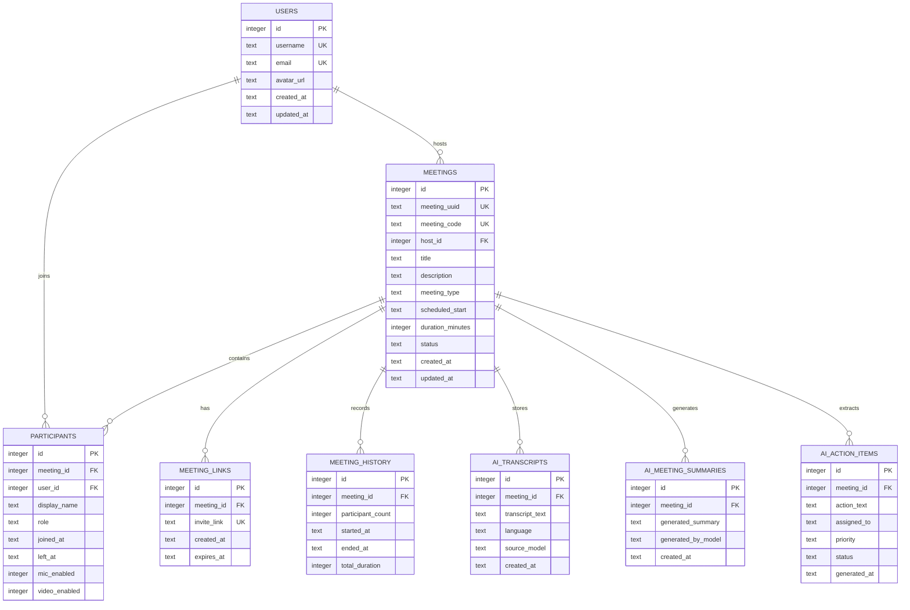

# SQL Schema Chart

This document shows the database structure for the AI-powered Zoom Clone backend. The schema is normalized so meeting metadata, participants, invite links, meeting history, transcripts, summaries, and action items can evolve independently.

## Entity Relationship Diagram



## Table Arrangement

```text
users
  ├── meetings.host_id
  └── participants.user_id

meetings
  ├── participants.meeting_id
  ├── meeting_links.meeting_id
  ├── meeting_history.meeting_id
  ├── ai_transcripts.meeting_id
  ├── ai_meeting_summaries.meeting_id
  └── ai_action_items.meeting_id
```

## Tables

### users

Stores registered platform users and future account/profile data.

| Column | Type | Key | Notes |
|---|---:|---|---|
| id | INTEGER | PK | Auto-increment user ID |
| username | TEXT | UNIQUE | Display/login username |
| email | TEXT | UNIQUE | User email |
| avatar_url | TEXT |  | Optional profile image |
| created_at | TEXT |  | Timestamp |
| updated_at | TEXT |  | Timestamp |

### meetings

Stores the core meeting object for instant, scheduled, recurring, or webinar-style meetings.

| Column | Type | Key | Notes |
|---|---:|---|---|
| id | INTEGER | PK | Auto-increment meeting ID |
| meeting_uuid | TEXT | UNIQUE | Public stable UUID |
| meeting_code | TEXT | UNIQUE | Human-friendly join code |
| host_id | INTEGER | FK | References `users.id` |
| title | TEXT |  | Meeting title |
| description | TEXT |  | Optional description |
| meeting_type | TEXT | CHECK | `instant`, `scheduled`, `recurring`, `webinar` |
| scheduled_start | TEXT |  | ISO timestamp |
| duration_minutes | INTEGER | CHECK | Must be positive |
| status | TEXT | CHECK | `scheduled`, `live`, `ended`, `cancelled` |
| created_at | TEXT |  | Timestamp |
| updated_at | TEXT |  | Timestamp |

### participants

Tracks who joined a meeting and their session state.

| Column | Type | Key | Notes |
|---|---:|---|---|
| id | INTEGER | PK | Auto-increment participant ID |
| meeting_id | INTEGER | FK | References `meetings.id` |
| user_id | INTEGER | FK | Nullable; references `users.id` |
| display_name | TEXT |  | Name shown in meeting |
| role | TEXT | CHECK | `host`, `cohost`, `participant`, `guest` |
| joined_at | TEXT |  | Join timestamp |
| left_at | TEXT |  | Nullable leave timestamp |
| mic_enabled | INTEGER | CHECK | Boolean-style 0/1 |
| video_enabled | INTEGER | CHECK | Boolean-style 0/1 |

Constraint:

```sql
UNIQUE (meeting_id, user_id)
```

### meeting_links

Stores invite links separately from meetings so links can expire or rotate.

| Column | Type | Key | Notes |
|---|---:|---|---|
| id | INTEGER | PK | Auto-increment link ID |
| meeting_id | INTEGER | FK | References `meetings.id` |
| invite_link | TEXT | UNIQUE | Join URL |
| created_at | TEXT |  | Timestamp |
| expires_at | TEXT |  | Optional expiration |

### meeting_history

Stores analytics-friendly runtime data for meeting sessions.

| Column | Type | Key | Notes |
|---|---:|---|---|
| id | INTEGER | PK | Auto-increment history ID |
| meeting_id | INTEGER | FK | References `meetings.id` |
| participant_count | INTEGER | CHECK | Must be non-negative |
| started_at | TEXT |  | Session start |
| ended_at | TEXT |  | Session end |
| total_duration | INTEGER |  | Duration in minutes |

### ai_transcripts

Stores transcript artifacts for AI processing and future semantic search.

| Column | Type | Key | Notes |
|---|---:|---|---|
| id | INTEGER | PK | Auto-increment transcript ID |
| meeting_id | INTEGER | FK | References `meetings.id` |
| transcript_text | TEXT |  | Full transcript text |
| language | TEXT |  | Example: `en` |
| source_model | TEXT |  | Manual/OpenAI/Groq/etc. |
| created_at | TEXT |  | Timestamp |

### ai_meeting_summaries

Stores AI-generated summaries as durable meeting artifacts.

| Column | Type | Key | Notes |
|---|---:|---|---|
| id | INTEGER | PK | Auto-increment summary ID |
| meeting_id | INTEGER | FK | References `meetings.id` |
| generated_summary | TEXT |  | AI recap |
| generated_by_model | TEXT |  | Provider/model name |
| created_at | TEXT |  | Timestamp |

### ai_action_items

Stores AI-extracted action items from meeting transcripts.

| Column | Type | Key | Notes |
|---|---:|---|---|
| id | INTEGER | PK | Auto-increment action item ID |
| meeting_id | INTEGER | FK | References `meetings.id` |
| action_text | TEXT |  | Task text |
| assigned_to | TEXT |  | Optional owner |
| priority | TEXT | CHECK | `low`, `medium`, `high`, `urgent` |
| status | TEXT | CHECK | `open`, `in_progress`, `completed`, `dismissed` |
| generated_at | TEXT |  | Timestamp |

## Foreign Key Behavior

| Relationship | Behavior |
|---|---|
| `meetings.host_id -> users.id` | `ON DELETE RESTRICT` |
| `participants.meeting_id -> meetings.id` | `ON DELETE CASCADE` |
| `participants.user_id -> users.id` | `ON DELETE SET NULL` |
| `meeting_links.meeting_id -> meetings.id` | `ON DELETE CASCADE` |
| `meeting_history.meeting_id -> meetings.id` | `ON DELETE CASCADE` |
| `ai_transcripts.meeting_id -> meetings.id` | `ON DELETE CASCADE` |
| `ai_meeting_summaries.meeting_id -> meetings.id` | `ON DELETE CASCADE` |
| `ai_action_items.meeting_id -> meetings.id` | `ON DELETE CASCADE` |

## Indexing Strategy

| Index | Purpose |
|---|---|
| `idx_users_email` | Fast email/user lookup |
| `idx_users_username` | Fast username lookup |
| `idx_meetings_uuid` | Public meeting lookup |
| `idx_meetings_code` | Join meeting by code |
| `idx_meetings_host_status` | Host dashboard queries |
| `idx_meetings_status` | Filter scheduled/live/ended meetings |
| `idx_meetings_scheduled_start` | Upcoming meeting ordering |
| `idx_participants_meeting` | Meeting participant sidebar |
| `idx_participants_meeting_role` | Host/cohost checks |
| `idx_ai_transcripts_meeting_created` | Latest transcript lookup |
| `idx_ai_summaries_meeting_created` | Summary history lookup |
| `idx_ai_action_items_meeting_status` | Action item dashboard/filtering |

## Design Summary

The schema is intentionally simple but production-minded:

- normalized tables
- explicit foreign keys
- cascade rules for meeting-owned data
- indexes for real API access patterns
- separate AI artifact tables
- timestamps for auditing and analytics

This makes the project easy to explain in interviews while still showing strong backend/database design.
